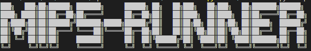

For converting your MIPS32 assembly to UoA Coderunner capable code. 

## Instructions

Using your favourite flavour of terminal run the command 
```python3 MIPS-Runner.py fileName.asm``` or ```python3 MIPS-Runner.py```
